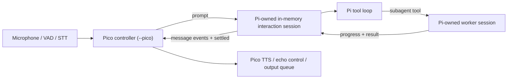

# Pi ホスト型アーキテクチャ回復設計

**日付:** 2026-07-12
**状態:** 一部廃止。Pi ownership は維持する。単一親conversation session境界は
[resident 一時会話セッション設計](./2026-07-19-resident-ephemeral-conversation-session-design.md)で、
Memory ownership は
[Pi 所有 memory 責務境界設計](./2026-07-13-pi-owned-memory-boundary-design.md)で置き換えられた。
**対象:** `pico` resident voice の実行所有権回復
**起点:** `origin/main` (`fdaf4955a829e4ad485a41153d38a29ce084afe3`)

> 2026-07-12 decision: `worker | interactive | resident` profile とPico内のtool
> filteringは廃止する。通常Piはcontrollerなし、`pi --pico`はYAML指定modelでPicoを
> 起動する。tool visibilityはPi settingsが所有し、Picoで重複実装しない。

> 2026-07-19 decision: 本文中の「既存親sessionへ`pi.sendUserMessage()`する」、
> 「本番から`createAgentSession()`を呼ばない」、「単一conversation session」という要件は
> 廃止する。現在の要件は、非保存Pi hostとinteraction単位のPi-owned in-memory
> `AgentSession`である。

## 1. 目的

Pico の resident voice を、Pi をホストとする単一プロセス構成へ戻す。

Pi が会話セッション、context/history、モデル、ツール、subagent、イベント、通常キャンセルを所有し、
Pico は施設固有の音声入出力、呼び掛け判定、状態表示、権限制約だけを所有する。

本設計は、凍結した旧ブランチ
`codex/pico-voice-orchestrator` を修理または移植する計画ではない。旧ブランチは失敗の
証拠として未変更のまま保存し、最新 `origin/main` から独立して実装する。

## 2. 背景と失敗の定義

現行のプロジェクト方針では、ランタイムは「1 Pi package + 1 TypeScript extension」で
あり、Pi が本番プロセスをホストする。しかし現在の `scripts/resident/voice.ts` は Pico
側から `createPiAgentTurnClient` を生成し、その内部で Pi SDK の `AgentSession` を所有する。

この構成を発展させた旧ブランチでは、さらに以下を Pico 側へ追加した。

- 独自 worker runner と worker extension loader
- resident session とは別の結果統合用 Pi session
- `VoiceTurnCoordinator` と `TaskRunManager`
- 大きな TaskRun JSON 永続化層
- Pi の subagent 機構と重複する process/session/cancel 管理

その結果、Pi と Pico の所有権が重なり、キャンセル、復旧、ツール権限、結果統合の
正解が複数になった。今回の回復では、この重複を互換維持せずに取り除く。

## 3. 根拠

### 3.1 参照資料

- `AGENTS.md`
- `docs/superpowers/specs/2026-06-18-voice-resident-runtime-design.md`
- `docs/superpowers/research/2026-07-12-pi-host-architecture-retrospective-and-handoff.md`
- 凍結ブランチの
  `docs/superpowers/specs/2026-07-11-pico-voice-orchestrator-design.md`
- `@earendil-works/pi-coding-agent` 0.80.6 の SDK と同梱 subagent example

旧ブランチの仕様は、プロダクト要求を抽出する資料としてのみ扱う。実装構造の
source of truth にはしない。

### 3.2 source of truth の移行

本設計が承認された時点で、
`docs/superpowers/specs/2026-06-18-voice-resident-runtime-design.md` のうち、Pico が Pi SDK
session を生成して resident agent turn を所有する判断を本設計で置き換える。同文書の
音声 capture、echo control、safeguarding に関する要求は、矛盾しない範囲で引き続き有効と
する。

凍結ブランチの `2026-07-11-pico-voice-orchestrator-design.md` は採用済み仕様ではなく、
retrospective の対象である。

### 3.3 Pi 能力の実証結果

ローカルに導入済みの Pi 0.80.6 を対象に、以下を実行して確認した。

1. Pico の `src/index.ts` と Pi 同梱 subagent extension を、同じ
   `AgentSession` に読み込める。
2. `pi.sendUserMessage()` は既存 Pi session の `prompt` へ
   `source: "extension"`、`expandPromptTemplates: false` で入力を渡す。
3. 親 Pi から subagent tool を呼び出し、子の進捗イベントと最終結果を同じ親 turn に
   返し、親がその結果を使って応答できる。
4. 通常の RPC `abort` は実行中の子を `Subagent was aborted` として終了させ、親を
   `agent_settled` まで収束させる。
一方、親プロセスを強制終了した実験では、subagent が起動した OS 子プロセスが残った。
通常キャンセル能力は実証済みだが、`SIGKILL` や電源断の後に、終了した Pi 自身が残留
process を回収することはできない。この異常残留は Pico runtime の自動再開機構で扱わず、
Codex の定期 stale-process cleanup が、所有根拠を確認したうえで最終回収する。

## 4. 設計原則

1. **単一ホスト:** Pi host processは一つとし、会話contextはinteraction単位のPi-owned
   in-memory `AgentSession`へ分離する。
2. **単一所有者:** Pi の機能は Pi が、施設固有機能は Pico が所有する。
3. **Pi SDK境界:** Pico domainはsession objectを持たず、薄いPi SDK adapterだけが
   interaction sessionをcreate、prompt、abort、disposeする。
4. **起動とtool可視性を分離:** 通常Piはcontrollerなしで起動し、Picoだけを`--pico`で
   明示起動する。通常Pi、Pico、subagentのtool可視性はPi設定が所有する。
5. **復旧情報を最小化:** Pi session にない会話本文やタスク複製を保存しない。
6. **異常残留を分離する:** 通常 abort は Pi が収束し、強制終了後の残留 process は
   Codex の定期 cleanup が最終回収する。

## 5. 所有権

| 関心事 | Pi 所有 | Pico 所有 |
|---|---|---|
| 本番プロセス、非保存host session、interaction AgentSession | Yes | No |
| model/auth/provider と prompt loop | Yes | No |
| tool registry と tool execution events | Yes | Pico tool の実装のみ |
| subagent の生成、進捗、結果、通常 abort | Yes | No |
| session persistence と transcript | Yes | No |
| microphone、VAD、STT | No | Yes |
| 名前・別名・attention window | No | Yes |
| status/cancel/end の決定的コマンド | Pi abort を実行 | 意図判定と表示 |
| TTS、echo control、単一出力キュー | No | Yes |
| safeguarding と施設固有メッセージ | No | Yes |
| conversation context/history | Yes | No |
| durable memory | Pi-level plugin（導入時） | No |

Pico domainは`createAgentSession()`を呼ばない。`src/runtime/pi-agent-turn.ts`のPi integration
adapterだけがinteraction用AgentSessionを生成する。Durable memory が必要な場合はPicoと
同列のPi-level pluginとして導入し、Picoはprovider、config、tool、extraction、retention、
lifecycleを所有しない。

## 6. 実行フロー

### 6.1 起動

1. Pi を本番ホストとして起動する。
2. 同じ Pico extension を通常どおり読み込む。
3. Picoを担う親プロセスだけに startup-only の `--pico` flagを明示する。
4. extension の `session_start` で Pico resident controller を一度だけ開始する。
5. subagentを含むtool可視性は各Pi設定に従い、Pico内で上書きしない。

`--pico` の選択とYAML modelは起動後に変更しない。変更にはPiプロセス再起動を必要とする。

### 6.2 音声 turn

1. Pico が音声を文字列化し、呼び掛け・コマンドを判定する。
2. 通常要求はPi SDK adapterの`prompt()`でactive interaction sessionへ渡す。
3. adapterは、その入力に対応するPi session eventsを集約する。
4. 最終 assistant text を一度だけ TTS キューへ渡す。
5. 応答完了は Pi の settled と Pico の playback 完了を分けて管理する。

音声入力を prompt template や slash command として展開しない。音声文字列は常に literal
user input として扱う。

### 6.3 cancel と shutdown

- 決定的な音声 cancel は active voice turn がある場合だけPi child sessionの`abort()`を呼ぶ。
- Pi の `agent_settled` までは agent state を終了扱いにしない。
- Pico は TTS/playback を独立して停止し、echo suppression を解除する。
- `session_shutdown` では新規入力を閉じ、Pico 所有の録音、タイマー、再生を drain する。
- Pi が所有する session/subagent/process を Pico が直接 kill しない。

## 7. Pico起動とtool可視性

通常PiはPico controllerを開始しない。`pi --pico`だけがYAML指定modelを選択してcontrollerを
開始する。`pico` commandはこの起動経路への薄いaliasである。camera/StackChanなどagent別の
tool可視性はPi設定で決定し、Pico runtimeにprofile、allowlist policy、fallbackを置かない。
Memory pluginの読込みとtool可視性もPi設定が所有し、Picoはmemory toolを登録・proxyしない。

## 8. 最小復旧メタデータ

Pi の session transcript と重複する TaskRun store は作らず、タスクの自動再開も行わない。
Picoはconversation entry、transcript、summary、memory cutoff payloadを保存しない。Picoの
interaction stateはsession ID、active/ended、開始・終了時刻、trusted trigger、inactivity
timerだけをprocess-localに保持し、terminal cleanup後に削除する。

## 9. 類似実装の判定

| 候補 | 判定 | 方針 |
|---|---|---|
| Pi `sendUserMessage` と parent session events | historical only | resident production pathでは使わない |
| Pi 同梱 subagent extension | exact reuse with gate | 独自 runner を作らず使う。強制終了ゲートを別途満たす |
| `src/runtime/pi-agent-turn.ts` | exact reuse | Pi-owned interaction sessionの薄いintegration adapterとして使う |
| `deferred-tool-coordinator` | superficially similar | camera の限定用途を維持し、汎用 task manager にしない |
| Pi-level memory plugin | separate owner | Picoから直接呼ばず、導入・tool可視性はPi設定へ委ねる |
| 旧 `TaskRunManager` / `VoiceTurnCoordinator` | rejected duplicate | 移植しない |

## 10. 最初のPRの範囲

最初のPRは「Pi host ownership foundation」に限定する。

### 10.1 実装する

1. Pico extension 内に、interaction単位のPi in-memory sessionへ入力する薄いresident turn
   boundaryを追加する。
2. startup-only の `--pico` controller起動とYAML model選択を追加する。
3. extension の session lifecycle に resident voice controller の start/stop を接続する。
4. 本番 resident entryはPi integration adapterの`createPiAgentTurnClient`を使う。
5. Pi のsubagent機構を利用し、agent別tool可視性はPi設定へ委ねる。
6. `AGENTS.md` と必要な運用文書へ、Pi/Pico 所有権を簡潔に明記する。
7. Pi の通常 abort と、Codex cleanup が扱う強制終了後の異常残留の境界を、再現可能な
   verification と運用文書に残す。

### 10.2 実装しない

- 旧ブランチからのファイル移植
- custom worker runner、loader、session bridge
- 第二の結果統合用 Pi session
- TaskRun JSON store
- 汎用 policy engine
- mock/fake/fallback provider
- address/attention/status 文法の全面移植
- 長時間 subagent の本番有効化
- 強制終了後のタスク自動再開
- 強制終了 orphan 問題を Pico 独自 process manager で迂回すること

呼び掛け・attention・決定的 command の既存プロダクト挙動は後続の小さなPRで移植する。最初の
PRは所有権を直すために、それらを再設計と同時に抱え込まない。

## 11. 状態境界

### 11.1 状態とライフサイクル

| 状態 | 所有者 | ライフサイクル | 終了条件 |
|---|---|---|---|
| `--pico` activation とYAML model | Pico extension | startup-only immutable | process exit |
| resident controller instance | Pico extension | Pi session | `session_shutdown` |
| active voice turn handle | boundary | one Pi turn | `agent_settled` または abort failure |
| audio capture / timers | Pico controller | resident session | stop/drain |
| TTS playback queue | Pico controller | resident session | playback complete/drain |
| parent/subagent sessions | Pi | Pi session/tool call | Pi lifecycle |

### 11.2 変更経路

許可する変更経路:

- startup CLI/config からPico activationとmodelを一度決定する
- `session_start` / `session_shutdown`
- microphone/STT callback
- Pi extension event callback
- 決定的 command callback
- focused test harness

禁止する変更経路:

- 起動後のPico activation/model hot reload
- 複数箇所からの resident controller 生成
- script からの別 Pi session 生成
- worker からの resident 能力昇格
- Pico からの subagent process 直接管理
- session replacement 後の古い context 保持

中央 enforcement point はPico extensionが所有する単一controller factoryとする。
tool可視性はPi設定が所有し、script、tool、各moduleが独自profileを解釈しない。

### 11.3 非同期所有権

- Pi: agent loop、tool call、subagent、agent abort、agent settled
- Pico boundary: 音声入力と active Pi turn の対応付け
- Pico controller: capture、status timer、TTS、echo suppression、shutdown drain

一つの resource に二つの cleanup owner を置かない。各 cleanup は冪等にし、session 再開時に
古い callback が新しい controller を変更できないよう generation または明示的 disposal で
閉じる。

## 12. 受入条件

### 12.1 構造

- 本番 resident startup path は`createPiAgentTurnClient`だけをPi session integration
  boundaryとして使い、domain moduleから`createAgentSession`を呼ばない。
- resident voice は Pico extension の `session_start` から一度だけ開始される。
- 通常PiはPico controllerを開始せず、Picoだけが`--pico`で音声resourceを所有する。
- custom subagent runner、second integration session、TaskRun store が存在しない。

### 12.2 挙動

- 音声由来文字列がactive Pi interaction sessionにliteral user inputとして一度だけ入る。
- 対応する最終 assistant text が一度だけ TTS に渡る。
- 同時voice turnの扱いが決定的で、interaction IDごとに一つを超えるPi sessionを作らない。
- cancel は active turn の Pi abort と Pico playback stop をそれぞれ一度だけ行う。
- shutdown は新規入力を拒否し、Pico resource を残さず drain する。
- `--pico`不在時はcontrollerを開始せず、Piのtool設定を変更しない。

### 12.3 検証

- focused tests は Red → Green で追加する。
- `just check` が通る。
- production entryがPi integration adapter以外からAgentSessionを作らないことを`rg`と
  構造テストで確認する。
- Pi extension loading と subagent tool 登録を実 SDK で確認する。
- 通常 abort の収束を実 SDK で確認する。
- 強制終了後に残り得る process を cleanup が安全に識別できる根拠を確認する。
- cleanup は executable name、年齢、CPU使用率だけで generic process を自動終了しない。
- 真の zombie (`STAT=Z`) は kill 対象にせず、親による reap が必要なものとして報告する。
- 変更した識別子・literal を `rg` し、意図した owner/helper 以外へ増えていないことを確認する。

## 13. PR分割

1. **PR 1 — Pi host ownership foundation:** 本設計の `10.1`。
2. **PR 2 — resident interaction parity:** address/alias、attention window、
   status/cancel/end、progress 文言を小さく移植する。
3. **Operations — stale process cleanup:** Codex schedule で候補を列挙し、所有根拠を
   確認した process だけを `TERM` する。generic process と zombie は自動 kill しない。
4. **Optional metadata:** 実際に必要と証明された owner marker だけを追加する。

各PRは独立して review/rollback 可能にし、旧ブランチの巨大差分を再現しない。

## 14. 代替案

### A. Pi RPC + 薄い audio sidecar

Pi を別プロセスのホストにし、Pico audio sidecar が RPC で入力する。障害分離は明確だが、
RPC 再接続と音声 turn 対応付けが増える。in-process extension で満たせない制約が判明した
場合の第二候補とする。

### B. Pico embedded Pi SDK

Pico が `AgentSession` を生成して Pi をライブラリとして使う。現在の矛盾と旧ブランチの
重複所有を再発させるため採用しない。

## 15. 承認事項

2026-07-12 に以下を承認済みとする。

1. 最初のPRを ownership foundation に限定する。
2. address/attention/status の完全移植は後続PRへ分離する。
3. runtime は強制終了後のタスク自動再開を持たない。
4. 強制終了後の異常残留は Codex の定期 stale-process cleanup が最終回収する。
5. Pico起動は`pi --pico`、model選択はYAML、tool可視性はPi設定を正本とする。
