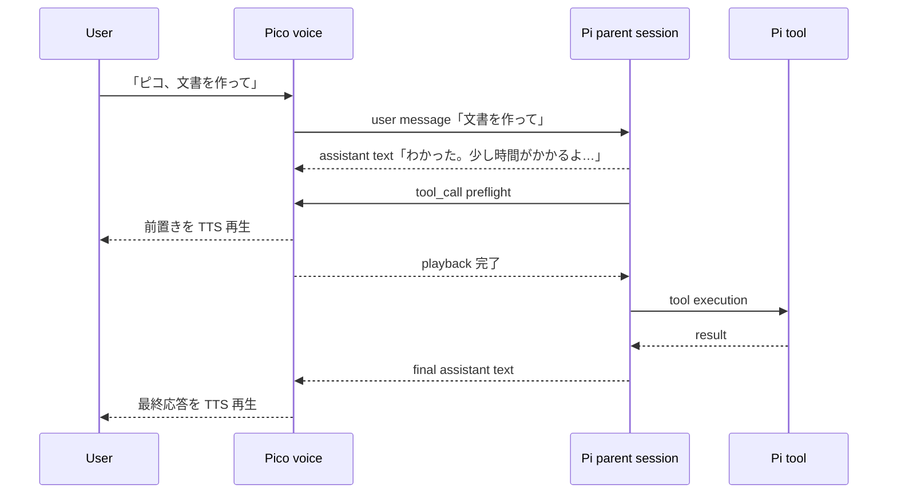

# Pico 常駐会話 UX 改善設計

**日付:** 2026-07-16
**状態:** 設計承認済み、書面レビュー待ち
**対象:** `pico` の起動、常駐音声セッション、Pi turn の発話順序、可視モニター

## 1. 目的

`pico` を短いコマンドで確実に起動し、専用ターミナルから「聞こえているか」「何を認識したか」
「現在何をしているか」を確認できるようにする。同時に、音声会話を次の体験へ改める。

1. 最初の「ピコ、○○して」で起動と依頼を同時に行う。
2. 一度起動した後は、同じ interaction session 中に毎回「ピコ」と呼ばなくてよい。
3. ツールを使う依頼では、Pico が短い前置きを読み上げてから実作業を開始する。
4. 長時間作業では、事実に基づく進行状況を確認でき、中止でき、完了を知ることができる。

本設計は Pi の会話・ツール実行所有権を変更しない。Pi が本番プロセス、親 conversation
session、history、model loop、tools、subagents、通常 cancel を所有し、Pico は施設音声、
attention、TTS、音声 UX と一時的な表示状態だけを所有する。

## 2. 背景と根拠

現行実装には、要求に近い要素が個別には存在する。

- `src/runtime/pico-cli.ts` の通常起動はローカル Pi に `--pico` だけを渡す。
- Pi の extension 自動検出対象に Pico package が含まれない環境では、`pico` が
  `Unknown option: --pico` で終了する。
- `pico dev` は専用 Terminal.app / kitty を開き、
  `pi --extension ./src/index.ts --pico` を実行できる。
- `src/runtime/voice-resident.ts` は active session 中の発話を wake name なしで受け付けるが、
  session を開始した最初の発話は wake acknowledgement だけに使い、同じ発話の依頼本文を
  Pi へ渡さない。
- 通常 turn は Pi の `agent_settled` まで待ってから全文を読み上げるため、ツール実行前の
  前置きにはならない。
- Pi 0.80.6 の extension event は、assistant text の `message_update`、実行前の
  `tool_call`、実行状況の `tool_execution_start/update/end`、turn 終了の
  `agent_settled` を提供する。`tool_call` handler はツール実行前に await できる。

このため、第二の Pi turn、独自 worker、TaskRun store を追加せず、同じ Pi turn の event
順序を利用して要求を満たせる。

### 2.1 Source of truth の関係

本設計は、次の既存判断を維持する。

- `2026-07-12-pi-host-architecture-recovery-design.md` の Pi/Pico 所有権と単一親 session
- `2026-06-18-voice-resident-runtime-design.md` の audio、echo control、privacy、provider
  fail-closed 契約

一方、同文書と現行実装のうち、通常 `pico` の起動方法、初回 wake 発話の扱い、interaction
inactivity、Pi response の読み上げ時点、長時間 turn 中の音声受理は本設計で具体化・置換する。
矛盾する場合は本設計を優先し、所有権・privacy の境界は置換しない。

## 3. スコープ台帳

### 3.1 今回実装するテーマ

- `pico` の短縮起動修正
- Pi TUI と Pico 音声状態を一つの専用ターミナルに表示
- 受理した発話本文の表示
- wake name 付き初回発話の依頼本文を同じ turn で実行
- 5分間の session attention window と明示終了
- ツール実行前の前置き読み上げと、作業後の最終応答読み上げ
- 長時間作業中の事実ベースの状態表示
- 長時間作業中の「今どう？」「やめて」「終わり」
- 完了・失敗の音声、ターミナル、macOS 通知

### 3.2 今回実装しないテーマ

- Stack-chan の「考え中」「完了」表情や動作との連動
- 推測による進捗率、残り時間、完了予定時刻
- 新規依頼のバックグラウンドキュー
- custom worker runner、第二の Pi session、TaskRun store、自動再開
- Pico 独自の tool allowlist、policy engine、memory store
- ambient speech、音声、Pico transcript log の保存
- Pico 内での Pi-level memory plugin / Qdrant の障害修正。Qdrant 障害は Pico から
  迂回せず、Pi-level memory plugin の所有 repository で別の failing test と修正を行う。
- direct resident voice field harness の本番化

Stack-chan の状態表現は魅力的だが、物理状態の所有者、割り込み優先順位、失敗時の原状回復を
別途設計する必要があるため、次段階に分ける。

## 4. 責務境界

| 関心事 | Pi | Pico |
|---|---|---|
| 本番プロセス、親 conversation session、history | 所有 | 所有しない |
| model loop、assistant text、tool call、tool execution | 所有 | event を観測する |
| tool visibility、subagent、通常 cancel | 所有 | 再実装しない |
| microphone、VAD、STT、echo control | 所有しない | 所有 |
| wake name、active attention、明示終了 | 所有しない | 所有 |
| 前置き・最終応答の TTS と再生順序 | text を生成 | 再生と gate を所有 |
| monitor の Pi 会話・tool 表示 | Pi TUI が所有 | 重複表示しない |
| monitor の音声 phase と受理 transcript | 所有しない | 一時表示を所有 |
| 長時間作業の実体と完了判定 | 所有 | event projection のみ保持 |
| 「やめて」 | active turn を abort | 意図を決定的に判定して要求 |
| durable memory | Pi-level plugin | 所有しない |

Pico の状態表示は Pi の source of truth を複製する業務状態ではない。現在の Pi event から作る
process-local projection であり、再起動後に復元しない。

## 5. 起動と専用モニター

### 5.1 `pico` 起動契約

引数なしの `pico` は macOS の専用 Terminal.app ウィンドウを一つ開き、その中で repository
local の Pi を次の意味で起動する。

```text
node_modules/.bin/pi --extension ./src/index.ts --pico
```

実際の組み立てでは repository root と config path を絶対化し、shell quoting を既存の
development terminal helper と同じ境界で行う。Pi の extension 自動検出には依存しない。
`pico` は引き続き Pi 起動への薄い alias であり、別の常駐 daemon を生成しない。

専用ターミナルを閉じるか Pi TUI を終了すると、同じプロセス内の Pico controller も停止する。
この終了で閉じるのは、その Pi/Pico process、controller、single-instance lock、launcher と専用
Terminal tab/window だけである。Apple Speech sidecar、Aivis Speech、Stack-chan gateway/tunnel など、
Pi/Pico process の外で共有される常駐 provider/service は停止しない。旧 direct harness の launchd
service は起動せず、本番所有経路を一本に保つ。`pico dev` は
開発用 probe/log 表示として区別し、通常 `pico` に development log 永続化を持ち込まない。

### 5.2 表示内容

専用ターミナルは Pi TUI を主表示とし、Pico extension が status/footer と terminal title を
更新する。別のログ pane や第二の console は作らない。

Pico status は少なくとも以下を区別する。

- `待機中` — wake name 待ち
- `聞き取り中` — active session の音声受理中
- `文字起こし中`
- `考え中` — Pi turn 開始済み、tool 未実行
- `読み上げ中` — Pico TTS/playback 中
- `作業中` — Pi tool 実行中。経過時間、現在の tool 名、最後に完了した tool 名を表示
- `中止中`
- `完了`
- `エラー`

進捗率や残り時間は Pi event に事実が存在しないため表示しない。tool arguments や結果本文を
Pico status へ複製しない。必要な詳細は Pi TUI の標準表示を参照する。

session に受理した STT 本文は認識時に TUI へ表示し、task 本文は通常の Pi user message として
会話にも表示する。wake-only や busy control の認識結果も一時表示するが、Pi user turn には
しない。wake 前の ambient speech、閾値未満、echo suppression 対象は表示も保存もしない。
受理本文を Pico probe、audit、voice log に追加保存しない。Pi session transcript の保存方針は
Pi が所有する。

## 6. Interaction session

### 6.1 開始

inactive 時の transcript から configured wake name を検出したら、次のいずれかとして扱う。

- wake name の後に本文がある: session を開始し、wake name 部分だけを除いた本文を同じ Pi
  user turn として送る。独立した wake acknowledgement turn は作らない。
- wake name だけ: session を開始し、短い「聞いている」応答だけを読み上げる。

wake name の除去は検出した span に限定し、本文中の同名語を一括削除しない。除去後の空白・
句読点だけを正規化する。

### 6.2 Active attention

session 中は wake name なしの発話を受理する。attention window は最後に完了した Pico playback
から5分で、受理した user utterance と assistant playback 完了時に更新する。

Pi turn、tool execution、TTS/playback が active の間は inactivity timer を進めない。長時間作業
の最終 playback が終わった時点から5分を数え直す。wall-clock sleep に依存せず、timer owner が
deadline を明示的に再設定する。

### 6.3 終了

設定された明示終了句は通常の user task として Pi に送らず、Pico が決定的に処理する。

- idle 中: 短い farewell を読み上げ、session を終了する。
- work 中: active Pi turn を一度だけ abort し、`agent_settled` と playback queue の収束後に
  farewell を読み上げて session を終了する。
- 5分無操作: farewell task を新しく生成せず、session を終了して `待機中` に戻る。

単なる「やめて」は active work の cancel であり、session 自体は維持する。明示終了とは分ける。

## 7. 一回の Pi turn での前置きと作業

### 7.1 基本フロー

音声由来の一つの user turn を、Pi の一つの turn として処理する。



Pi の system prompt は、tool を使う場合に最初の assistant text として、依頼理解と開始を伝える
短い自然な日本語を出す。長時間になりうる場合は「少し時間がかかる」「終わったら声をかける」
ことも含める。定型文一種類に固定しない。

### 7.2 Tool-start voice gate

Pi host turn boundary は、voice-originated active turn ごとに一つだけ gate 状態を持つ。

1. 最初の tool call より前に届いた assistant text delta を前置き候補として集約する。
2. 最初の `tool_call` handler は、前置きの synthesize と playback 完了を await する。
3. sibling / 後続 tool call は同じ一回限りの promise を await し、前置きを重複再生しない。
4. playback 完了後だけ tool execution を進める。
5. tool 後に生成された assistant text は最終応答として分離し、`agent_settled` 後に一度だけ読む。

Pi の `tool_execution_start` は preflight 時点で `tool_call` より先に通知されるため、この event
だけで実作業開始とは表示しない。tool 名を準備中として保持し、voice gate が解放された後に
`作業中` へ移る。

model が tool call 前に発話可能な text を一切出さなかった場合は、Pico が短い汎用前置き
「わかった。今から始めるね。」を一度だけ読む。これは model/provider fallback ではなく、
音声順序契約を守るための deterministic UI fallback である。

typed/manual Pi turn、subagent 内部 turn、voice turn 以外には gate を適用しない。tool policy や
permission 判定を Pico に持ち込まず、再生順序だけを制御する。

### 7.3 音声障害

tool 実行前の前置き TTS または playback が失敗した場合、その voice turn の tool を無言で開始
しない。tool call を fail closed し、Pi turn を abort/settle させ、ターミナルに `エラー` と原因を
表示する。別 TTS provider への自動 fallback は行わない。

tool 完了後の最終 TTS が失敗した場合、完了済み tool を再実行しない。Pi TUI と macOS 通知に
完了または失敗の事実と音声出力障害を表示し、session は利用可能な状態へ収束させる。

## 8. 長時間作業 UX

### 8.1 Work projection

Pico は active voice turn 中の Pi events から、次の一時状態だけを投影する。

- turn 開始時刻と経過時間
- phase (`thinking | preface | working | cancelling | finalizing`)
- 現在実行中の tool 名
- 最後に完了した tool 名
- tool 成功・失敗
- active turn の cancel 要求済み flag

これは表示と音声制御のためだけの process-local state であり、task record ではない。tool input、
result、user transcript、assistant本文を保存しない。Pi が再起動したら復元・再開しない。

### 8.2 作業中の音声 control lane

現状の逐次 turn 待ちを改め、Pi turn 実行中も microphone/VAD/STT の capture loop は継続する。
ただし、同時に二つ目の Pi prompt は送らない。busy 中に受理するのは次の bounded control だけで
ある。

- 状態照会（例: 「今どう？」「まだ？」）: projection の事実から短いローカル応答を作り、
  Pico TTS queue で読む。新しい Pi turn を作らない。
- cancel（例: 「やめて」「中止して」）: active Pi turn に一度だけ abort を要求し、`中止中` を
  表示する。session は維持する。
- 明示終了: active turn の abort/settle 後に session を終了する。

それ以外の新しい依頼は queue に積まず、「今の作業が終わってから、もう一度お願いしてね」と
短く応答する。これにより custom runner、TaskRun store、auto-resume を導入しない。

control 応答も既存の単一 TTS/playback queue と echo control を通り、前置き・完了音声と重複再生
しない。cancel 後の遅着 assistant delta、tool update、final playback は active turn identity と
terminal state を確認して抑止する。

### 8.3 完了通知

Pi の `agent_settled` と最終 playback 完了を別々に追跡し、両方が収束した時点を voice task の
完了とする。

- 成功: 最終応答を読み、terminal title/status を `完了` にし、macOS 通知を出す。
- Pi/tool 失敗: 確定した失敗だけを読み、`エラー` と通知する。
- cancel: 遅着結果を読まず、`中止しました` と通知し、session 待機へ戻る。

macOS 通知本文には transcript、tool arguments、tool result を含めない。

## 9. Error handling と shutdown

- Pi extension を明示読み込みできない場合、専用ターミナルに理由を残して非0終了する。
- microphone、STT、TTS、Pi turn の provider 不足は fail closed とし、自動 provider chain を
  追加しない。
- monitor/status 更新失敗は Pi turn を失敗させない。可能な範囲で stderr/TUI に一度だけ通知する。
- notification 失敗は音声 task の成功を失敗へ変更しない。
- status query 中に projection が既に terminal なら、最新 terminal state を返す。
- cancel は冪等とし、Pi `abort()` を active turn あたり最大一回呼ぶ。
- shutdown は新規音声受理を閉じ、active Pi turn を abort し、tool gate、TTS queue、capture、
  timers を bounded grace 内で drain する。
- shutdown 完了後は event subscriber が UI/state を更新せず、未解決 promise や timer を残さない。
- Pi が所有する tool/subagent process を Pico が直接 kill しない。
- shutdown は共有 provider/service の lifecycle を所有しない。専用 Terminal の終了処理から
  Apple Speech sidecar、Aivis Speech、Stack-chan gateway/tunnel を停止しない。

## 10. State Boundary

1. **State being changed:** active interaction ID、attention deadline、active voice turn identity、
   voice phase projection、current/last tool、cancel flag、一回限りの tool-start playback promise、
   TTS queue と shutdown flag。起動時には Pi extension path と Pico config path を確定する。
2. **Lifecycle boundary:** config、extension load、event subscription は
   `startup-only-immutable`。interaction/turn projection は同一 Pi process 内だけで変化し、
   shutdown 時に破棄する。runtime hot reload、restart 後の復元は行わない。
3. **Mutation path inventory:** accepted STT、wake/ending/control phrase 判定、Pi
   `message_update` / `tool_call` / `tool_execution_*` / `agent_settled`、TTS completion、attention
   timer、abort、session shutdown、テスト用 fake event/clock が適用対象。CLI/env は startup
   config のみ。API、admin job、migration、config watcher、background worker、rollback store は
   非適用。
4. **Consumer/invariant inventory:** voice capture loop、interaction lifecycle、Pi host turn client、
   TTS/echo queue、Pi TUI status、terminal title、macOS notification、resident counters/probes、
   shutdown、focused smoke tests。Pi transcript、tool policy、memory plugin は projection consumer
   にしない。
5. **Central enforcement point:** accepted utterance と session transition は resident voice の既存
   interaction boundary、Pi turn identity・text partition・tool-start gate・abort-once は
   `PiHostTurnClient` boundary、音声直列化は既存 TTS/playback queue に必ず通す。各 event handler
   が独自 flag を直接変更する構成にしない。
6. **Forbidden paths:** wake 発話を acknowledgement 後に捨てること、busy 中に第二の Pi prompt
   を送ること、tool ごとに前置きを再生すること、typed Pi turn を音声 gate すること、直接
   shared state を書き換えること、ambient transcript を表示・保存すること、独自 TaskRun/queue/
   worker/session/memory store を作ること、Pico から tool/subagent process を直接 kill すること。
7. **Required tests:** 正常 transition、wake+本文、wake-only、active no-wake、missing/default config、
   5分 timeout、busy timer suspension、明示終了、tool 前 playback 順序、前置き欠落 fallback、
   sibling tool の一回 gate、typed turn bypass、busy status、拒否される新規依頼、abort-once、
   遅着 event 抑止、ambient transcript 非表示、notification failure、TTS failure、shutdown drain。
   clock、events、playback は deterministic fake を使い wall-clock race を作らない。
8. **Async ownership and terminal states:** Pi host turn client が Pi acknowledgement、tool gate、
   abort、`agent_settled` を所有し、voice runtime が capture、TTS acknowledgement、attention
   suppression、notification、shutdown drain を所有する。terminal state は
   `completed | failed | cancelled | closed`。terminal 到達後に active turn、gate promise、tool
   projection、timer を process-local state から削除する。delivery acknowledgement、cancel、
   expired/suppressed utterance、shutdown wait を deterministic test で検証する。shared provider/service
   の process lifetime はこの state machine の外にあり、shutdown consumer に含めない。

## 11. テスト戦略

behavior change は TDD で Red → Green → Refactor の順に実装する。

### 11.1 起動

- 引数なし `pico` が専用 Terminal.app plan を作る。
- terminal 内 command が local Pi、明示 extension、`--pico` を含む。
- extension discovery なしでも起動 command が成立する。
- quoting、非0終了、終了時 cleanup を検証する。

### 11.2 Session と transcript

- 「ピコ、○○して」が一つの accepted Pi user message `○○して` になる。
- wake-only は task を送らず acknowledgement する。
- active session は wake name なしで受理する。
- inactive ambient speech は TUI/Pico log/session へ出ない。
- fake clock で5分 expiry と busy suspension を検証する。

### 11.3 前置き gate

- `message_update → tool_call → playback resolve → tool execution` の順序を promise barrier で
  検証する。
- 複数 tool call が一つの playback promise を共有する。
- 前置き text なしでは汎用前置きが一度だけ流れる。
- pre-tool text と post-tool final text が重複して読まれない。
- typed/manual turn には gate がない。
- preface TTS failure は tool を開始しない。

### 11.4 長時間作業

- active turn 中も control utterance を受理する。
- 「今どう？」は Pi prompt を増やさず、projection の事実だけを答える。
- 新規依頼を queue しない。
- cancel は Pi abort を一回だけ呼び、遅着出力を読まない。
- completion、failure、cancel、notification failure が正しい terminal state に収束する。
- shutdown が gate、playback、capture、timer の完了を待つ。

focused tests の後に `just typecheck`、`just lint`、`just ast`、`just test` を実行し、最後に
`just check` で全 local gate を確認する。繰り返し追加した識別子・文言は `rg` で所有箇所を
確認する。

## 12. 受け入れ条件

1. `pico` だけで、Pico extension を明示読み込みした Pi TUI が専用ターミナルに起動する。
2. ターミナルから待機、認識、思考、読み上げ、tool 作業、完了、失敗を判別できる。
3. session に受理した発話本文は Pi TUI で見えるが、ambient speech は見えず、Pico log に本文を
   永続化しない。
4. 「ピコ、依頼」で、その依頼が最初の turn として実行される。
5. 以後は明示終了または最終 playback から5分まで、wake name なしで会話できる。
6. tool を使う音声 turn は、前置きの読み上げ完了後にだけ最初の tool を開始する。
7. tool 完了後の最終応答を一度だけ読み上げる。
8. 長時間作業中に状態照会と cancel ができ、新しい task は queue されない。
9. 完了・失敗・cancel が音声、TUI、macOS 通知で確定的に分かる。
10. Pi/Pico の所有権を越える第二 session、worker、TaskRun store、policy、memory 実装がない。
11. Pico 終了時は専用 Terminal とその Pi/Pico process だけが閉じ、共有の常駐 provider/service は
    動作を継続する。

## 13. 実装分割の指針

一つの実装計画の中で、依存順に次の slice へ分ける。

1. 通常 `pico` の dedicated terminal 起動と status surface
2. wake+本文、5分 attention、明示終了
3. Pi event による pre-tool text partition と tool-start voice gate
4. busy control lane、cancel、completion notification、shutdown convergence

各 slice は failing test から開始し、Pi ownership を保ったまま単独で検証可能にする。
