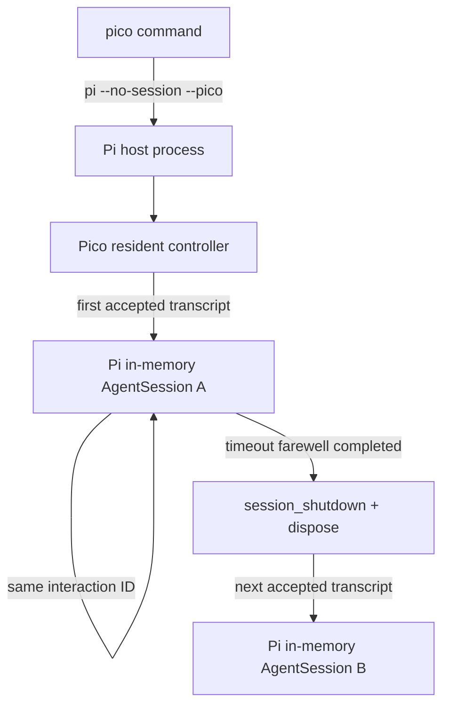

# resident 一時会話セッション設計

**日付:** 2026-07-19
**状態:** 承認済み
**対象:** `pico` resident voice の会話コンテキスト境界

## 1. 目的

Pi がホストする Pico の常駐プロセスを維持しながら、施設内の独立した対話どうしで
conversation context と history を共有しない。

Pico は PTT、無操作時間、終了挨拶によって対話の開始・終了を決める。Pi SDK integration
は、その期間だけ有効な非永続 `AgentSession` を作成し、終了時に破棄する。

## 2. 置換する判断

本設計は
[Pi ホスト型アーキテクチャ回復設計](./2026-07-12-pi-host-architecture-recovery-design.md)
のうち、resident voice の全入力を一つの Pi 親 conversation session に入れる判断を
置き換える。

同じsession境界を前提としていた
[Pico Agent Design](./2026-06-09-pico-agent-design.md)、
[Pico Voice Resident Runtime Design](./2026-06-18-voice-resident-runtime-design.md)、
[Pico Hold-to-Talk Resident Control Design](./2026-07-17-hold-to-talk-resident-control-design.md)
の該当箇所も本設計に合わせる。PTT、cancel、audio、memory ownershipの要求は変更しない。

以下は引き続き有効とする。

- Pi が本番プロセス、model/auth/provider、AgentSession、prompt loop、tool、subagent、
  通常 cancel を所有する。
- Pico が PTT、microphone、STT、interaction timeout、TTS、echo control を所有する。
- tool visibility は Pi の起動設定を正本とし、Pico 独自 allowlist を本番経路に置かない。
- durable memory は Pi-level plugin が所有し、Pico は extraction、provider、store、tool、
  lifecycle を持たない。
- custom worker runner、TaskRun store、自動再開、第二の結果統合 session は作らない。

## 3. 調査結果

対象はローカル導入済みの `@earendil-works/pi-coding-agent` 0.80.6 とする。

1. `createAgentSession({ sessionManager: SessionManager.inMemory() })` は transcript を
   session file に保存しない。
2. `AgentSession.dispose()` は active operation を abort し、extension runner を無効化し、
   listener と session resource を解放する。
3. `ctx.newSession()` は deadlock を避けるため `ExtensionCommandContext` に限定される。
   resident callback が親 session を自動交換する用途には使えない。
4. session replacement 後の古い `pi` と `ctx` は無効になる。親 session の交換は常駐
   controller も巻き込むため採用しない。
5. Pi CLI の `--no-session` は親ホストを非保存モードで起動する。プロセス内の host
   session は存続するが、session file は残さない。
6. 既存の `src/runtime/pi-agent-turn.ts` は Pico interaction session ID ごとに
   in-memory `AgentSession` を再利用し、`disposeSession()` で破棄する lifecycle をすでに
   実装している。
7. ローカルで `DefaultResourceLoader.reload()`、session 作成、extension bind を一回
   計測した結果は約 730 ms だった。これは環境依存の単発値であり SLA ではない。

## 4. 所有権

| 関心事 | 所有者 |
|---|---|
| 常駐 Pi process と非保存 host session | Pi |
| interaction の開始、継続、timeout、終了 | Pico |
| interaction に対応する `AgentSession` object | Pi SDK integration |
| context、history、model loop、tool execution | 各 Pi `AgentSession` |
| model、thinking level、active tool の起動時選択 | Pi host |
| session file、resume、compaction、transcript store | 実装しない |
| durable-memory extraction と persistence | 別導入の Pi-level plugin |

「Pi SDK integration」は Pico domain の session store ではない。Pi SDK への薄い adapter として、
create、prompt、abort、dispose だけを扱う。

## 5. 実行フロー

1. `pico` は Pi を `--no-session --pico` で起動する。
2. startup で YAML 指定 model を認証し、clamp 後 thinking level と active tool names を
   immutable snapshot として取得する。
3. 最初の有効な音声 transcript で Pico interaction session を開始する。
4. 同じ Pico session ID の turn と終了挨拶は同じ Pi `AgentSession` を使う。
5. timeout 後、終了挨拶の Pi turn と TTS playback を完了する。
6. Pi extension の `session_shutdown` を通知してから `dispose()` する。
7. 次の有効な transcript は新しい in-memory `AgentSession` を作る。

## 6. model と tool の継承

子 `AgentSession` は startup で親 Pi が確定した次を明示的に受け取る。

- exact model object
- clamp 後 thinking level
- active tool names

子 session の resource loader は Pi settings から extension を読み込む。本番経路では
Pico固有の固定 tool allowlistを再定義せず、親 Pi の active tool snapshot をそのまま
enforceする。toolやplugin構成を変更した場合は Pico process を再起動する。

Pi SDK が extension の読込失敗または名前競合を報告した場合、child session は bind と
prompt の前に終了して dispose する。tool 名の不足・余剰検査だけで diagnostics を代用しない。

## 7. cancel と cleanup

- cancel button は active Pi turn を `abort()` し、Pico playback を停止する。
- 通常 timeout は終了挨拶を完了してから session を破棄する。
- shutdown は active interaction を閉じ、全 Pi child session の settlement を待って
  `disposeAll()` する。
- dispose failure は session map からの所有権解放を妨げず、runtime failure として
  bounded error を返す。
- `dispose()` は外部 memory provider のデータを削除しない。memory side effect は
  Pi-level plugin が自身の hook と policy で所有する。

## 8. latency 方針

初回 child session setup は最初の `pi_turn` wall-clock duration に含める。同じ interaction
内の後続 turn では同じ child session を再利用する。

初期実装では以下を追加しない。

- blank session の常時 prewarm
- session pool
- 二重の extension/MCP connection
- parent と child 間の transcript copy

実機 telemetry で session setup が主要 bottleneck と確認された場合に限り、Pi SDK 側の
session factory または安全な prewarm 契約を別設計として検討する。

## 9. 実装しないもの

- parent session への `/new` または `ctx.newSession()` 自動発行
- Pico内のconversation/session database
- session resume、fork、compaction、summary
- Mem0/Qdrant client、memory extraction worker、cutoff hook
- custom worker runner、TaskRun store、自動再開
- promptによる擬似的なcontext reset

## 10. 受入条件

- `pico` alias が `--no-session --pico` で Pi を起動する。
- production resident path が `pi.sendUserMessage()` を会話処理に使わない。
- startupで確定したmodel、thinking level、active tool namesがchild sessionに渡る。
- extensionの読込失敗または名前競合はbind/prompt前にfail-closedする。
- 同じPico session IDの複数turnは同じPi sessionを使う。
- timeoutの終了挨拶後にそのPi sessionが一度だけdisposeされる。
- 次のPico session IDは新しい空のPi sessionを使う。
- child sessionは`SessionManager.inMemory()`を使い、session fileを作らない。
- Picoにmemory provider、worker、store、resume機構を追加しない。
- focused testsと`just check`相当の全gateが通る。
