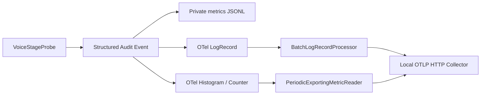

# resident voice OpenTelemetry 設計

**日付:** 2026-07-19
**状態:** 承認済み
**対象:** resident voice のレイテンシ計測、OTLP輸出、運用診断

## 1. 目的

Pico resident voice の応答遅延を、実行ごとの証拠と長期的な分位値の両方から診断できる
ようにする。Collectorや観測バックエンドの障害は音声対話から隔離し、計測コード、
ローカル永続化、OTLP輸出の責務を分離する。

## 2. 採用判断

単一のvoice stage計測契約から、次の3出力を生成する。

1. ローカルJSONLへ個々のstage eventを永続化する。
2. OpenTelemetry Logsへ監査eventをbatch輸出する。
3. OpenTelemetry Metricsへstage duration histogramとcompletion counterをperiodic輸出する。

OpenTelemetry Tracesはこの変更では追加しない。Pico、Pi、Apple Speech、Aivis Speech間で
trace contextを伝播する契約がなく、Pico内だけの孤立したspan treeはcontext propagationと
lifecycle管理の複雑性に見合う診断価値を持たない。将来、provider境界をまたぐcontext
propagationを設計するときに追加する。

## 3. 構成



`VoiceStageProbe`が計測値の唯一の生成元である。JSONL、Logs、Metricsの各sinkは完成済みの
同一eventを消費し、独自に経過時間を再計測しない。

OpenTelemetry providerは監査moduleから分離したtelemetry ownerとして構成する。監査module
はevent validationとLogRecord mappingを所有し、telemetry ownerはSDK provider、batching、
exporter、metric instrument、flush、shutdown、export healthを所有する。

## 4. 設定契約

既存の`audit.otel`は監査Logs専用の名前であり、voice Metricsを所有できないため、
`telemetry.otel`へ置き換える。後方互換の二重設定や自動移行は追加しない。

```yaml
telemetry:
  otel:
    enabled: false
    baseUrl: http://127.0.0.1:4318
    serviceName: pico
    timeoutMs: 10000
    metricExportIntervalMs: 15000
    shutdownTimeoutMs: 5000
```

`baseUrl`はcredentials、query、fragment、pathを持たないHTTP(S) loopback originだけを許可する。
Logsは`/v1/logs`、Metricsは`/v1/metrics`へ送る。設定はstartup時に一度だけ読み、実行中の
hot reloadは行わない。

## 5. OTel signal契約

### Logs

既存の`AuditEvent`をOTel `LogRecord`へ変換し、`BatchLogRecordProcessor`で輸出する。
イベント本文と属性のallowlist、サイズ上限、raw payload禁止規則は既存audit contractを
そのまま使用する。

### Metrics

次のinstrumentを作る。

- `pico.voice.stage.duration`: unit `ms`のHistogram。
- `pico.voice.stage.completions`: monotonic Counter。

両instrumentの属性は`pico.voice.stage`と`pico.voice.stage_status`だけとする。
session ID、generation ID、tool名、model名、endpoint、error messageをmetric labelにしない。
Histogramの値は`pico.voice.stage_duration_ms`だけを使用する。

### Export health

OTLP exporterのsuccess/failure callbackから、最終成功時刻、最終失敗時刻、連続失敗回数を
process-local health snapshotへ記録する。失敗通知は同一障害の連続出力を抑制し、process logへ
bounded metadataだけを記録する。会話処理はexport完了をawaitしない。

shutdownでは、設定時間内でLogsとMetricsをforce-flushしてからproviderをshutdownする。
exportまたはshutdownの失敗はprocess logへ残すが、既存の音声runtime failureへ昇格させない。
ローカルJSONLはOTel状態に依存せず継続する。

## 6. 計測境界

すべてのdurationはmonotonic clockで測り、wall-clockはevent timestampにだけ使う。

既存stageに加えて次を固定enumへ追加する。

| Stage | 開始 | 終了 |
|---|---|---|
| `ptt_release_to_playback_start` | accepted `talk_released` | 最初のplayback provider呼び出し直前 |
| `pi_time_to_first_text` | Pi prompt受付 | 最初のnon-empty text delta |
| `pi_session_resource_load` | child resource reload開始 | reload settlement |
| `pi_session_create` | Pi SDK child session生成開始 | factory settlement |
| `pi_session_bind` | extension bind開始 | tool contract検証完了 |
| `pi_tool_execution` | Pi SDK tool execution start | 対応するtool execution end |
| `pi_session_dispose` | session shutdown通知開始 | `dispose()`完了 |
| `interaction_end` | lifecycleのended通知受付 | farewell、deferred cancellation、Pi dispose、record removal完了 |

`ptt_release_to_playback_start`はPicoが観測できる出力provider dispatchまでを表す。speaker driver
または物理デバイスが実際に発音を開始する時刻とは呼ばない。OS/driver latency metadataを取得
できるproviderへ交換した場合は、別属性または別stageとして明示する。

`pi_time_to_first_text`はsession準備、plugin hook、model first-token latencyを包含する。
個別plugin、特にMem0の内部処理時間はPicoで計測しない。Pi-level pluginが自身のtelemetryを
所有する。

tool call IDは対応付けのためprocess memory内でだけ使用し、eventやmetricへ出さない。promptが
text deltaなしでsettleした場合、`pi_time_to_first_text`は`skipped`または`error`として一度だけ
記録する。cancel、provider failure、shutdownでも開始済みstageは必ず一度settleさせる。

## 7. lifecycleと障害隔離

- OTel providerはresident voice startupで一度だけ生成する。
- audit eventの同期生成後、ローカルJSONLとOTel providerへfan-outする。
- OTel sinkの例外は他sinkへの記録を妨げない。
- resident voice shutdownはOTel flush/shutdownをboundedにawaitする。
- exporter queueはSDK batch processorの固定上限を使用し、無制限の独自Promise queueを作らない。
- Collector未起動、接続拒否、timeout、invalid responseは音声runtimeを停止しない。
- 設定不正はstartup config errorとしてfail-closedする。

## 8. Collector運用

リポジトリにloopback限定のCollector設定例とbounded smokeを置く。smokeはtest audit eventと
test metricを出力し、force-flushの成功を確認する。Collector binaryの自動installや常駐管理は
Pico runtimeの責務にしない。

Collectorがない環境では`telemetry.otel.enabled: false`で運用できる。この場合もJSONL、
stdout probe、`resident:voice:metrics`は利用できる。Collectorを有効化した実機検証では、Logsと
Metricsの両receiverへの到達、shutdown flush、Collector停止中の音声継続を確認する。

## 9. プライバシーとカーディナリティ

OTel Logs、Metrics、voice metrics JSONLのいずれにも次を出さない。

- raw audioまたは音声payload
- transcript、prompt、completion
- secret、credential、URL query
- childまたはstaffのprofile、score、tracking data
- session ID、generation ID、tool call ID、物理キー名

tool名とmodel full nameもmetric labelにしない。errorは固定enumのerror codeだけを出す。
既存のprivate resident lifecycle logはinteraction相関用のopaque session IDを保持するが、本文を
保持せずOTelへは輸出しない。

この制約だけではfield validationの正しさを確認できない。明示的な擬似音声検証では、通常
runtimeとは別のprivate validation sinkへ、STT認識本文、Pi応答本文、tool名、引数、結果、成否、
実行時間を保存する。この成果物はcurrent user所有・mode `0700`・非symlinkのdirectory内に
新規作成するmode `0600`のローカルJSONLとし、既存成果物への追記、OTel、通常resident log、
audit eventへのfan-outを行わない。tool payloadは循環参照や巨大値で検証自体が壊れないよう
上限付きで保存する。通常起動ではvalidation sinkを構築しない。
field commandで`--required-tool-name`を指定した場合、そのtoolの正常終了がなければ検証結果を
failedとする。本文だけ取得できたturnをtool検証成功として扱わない。

## 10. 受入条件

- resident voiceの同一stage eventがJSONL、OTel Logs、OTel Metricsへ重複計測なしで流れる。
- OTel無効時にproviderとexport timerを作らない。
- OTel有効時も音声hot pathがnetwork exportをawaitしない。
- Collector停止中もPTT、STT、Pi、TTS、playback、interaction endingが継続する。
- shutdownが設定時間内にflushとprovider cleanupを完了する。
- Histogramからstage/status別の件数、p50、p95を算出できる。
- 追加stageが成功、失敗、cancelの全settlementで一度だけ記録される。
- `pi_time_to_first_text`と`pi_turn`からTTFTとfirst-text後の残り時間を区別できる。
- `pi_session_resource_load`、`pi_session_create`、`pi_session_bind`から初回turn setupを分解できる。
- field smokeがLogsとMetricsの送信、およびCollector障害時のfail-softを検証する。
- focused testsと`just check`が通る。

## 11. 非対象

- OpenTelemetry Tracesとcross-provider trace propagation
- Collector binaryのinstall、launchd ownership、外部backendのprovisioning
- transcriptまたはaudio contentのobservability backend保存
- Mem0、Qdrant、Ollama embedderの内部telemetry
- 自動的なmodel thinking level変更
- telemetry結果によるruntime policyの自動変更
